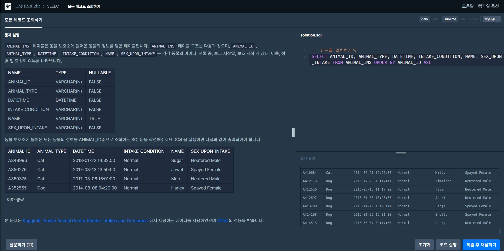
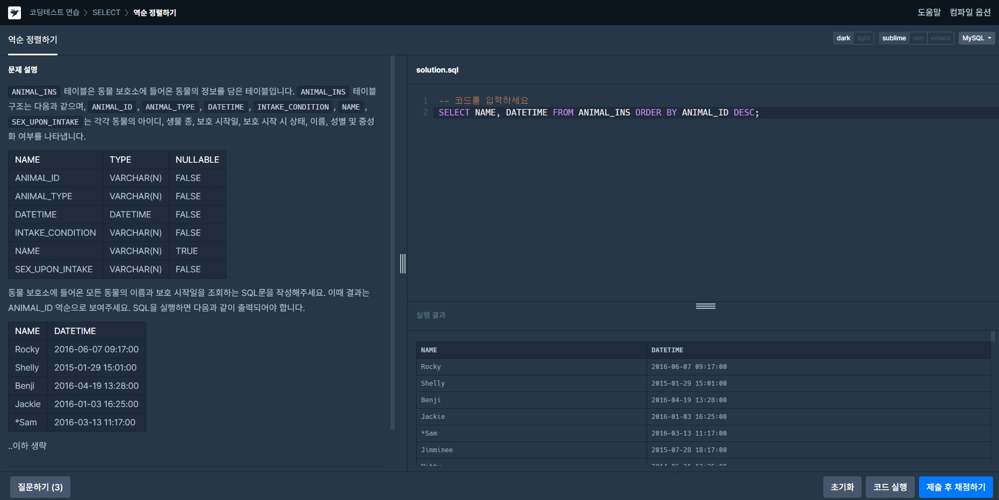
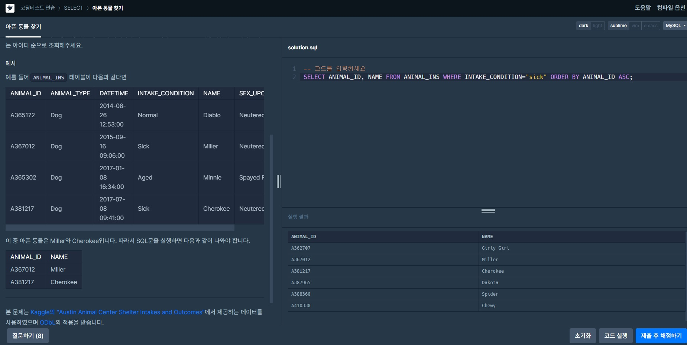
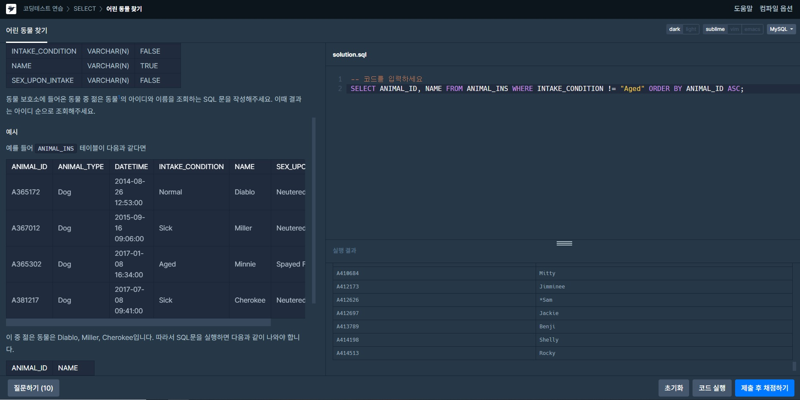

# SELECT를 이용한 레코드 조회  
 

## 모든 레코드 조회하기  
  
>**SELECT** ANIMAL_ID, ANIMAL_TYPE, DATETIME, INTAKE_CONDITION, NAME, SEX_UPON_INTAKE   
>**FROM** ANIMAL_INS **ORDER BY** ANIMAL_ID **ASC**;  
>SELECT 조회할 정보 FROM 테이블명 ORDER BY(정렬방법) ANIMAL_ID(동물ID를 기준으로) ASC(오름차순)  
>조회할 정보를 조회할 테이블에서 ID를 기준으로 오름차순 정렬  

  

## 역순 정렬하기  
  
>**SELECT** NAME, DATETIME **FROM** ANIMAL_INS **ORDER BY** ANIMAL_ID **DESC**;  
>역순으로 정렬하는 것을 요구하였기에 DESC(내림차순)를 이용했다.  

 

## 아픈 동물 찾기
>문제: 동물 보호소에 들어온 동물 중 아픈 동물의 아이디와 이름을 조회하는 SQL 문을 작성해주세요. 이때 결과는 아이디 순으로 조회해주세요.  
  
>**SELECT** ANIMAL_ID, NAME **FROM** ANIMAL_INS **WHERE** INTAKE_CONDITION="sick" **ORDER BY** ANIMAL_ID **ASC**;  
>INTAKE_CONDITION의 값이 sick이면 아픈 동물이기에 WHERE 조건을 이용해서 검색했다.  

 

## 어린 동물 찾기
>문제: 동물 보호소에 들어온 동물 중 젊은 동물의 아이디와 이름을 조회하는 SQL 문을 작성해주세요. 이때 결과는 아이디 순으로 조회해주세요.  
  
>**SELECT** ANIMAL_ID, NAME **FROM** ANIMAL_INS **WHERE** INTAKE_CONDITION != "Aged" **ORDER BY** ANIMAL_ID **ASC**;  
>위 문제와 같은 개념이고 INKATE_CONDITION의 값이 Aged이 아니어야 젊은 동물이다.  
