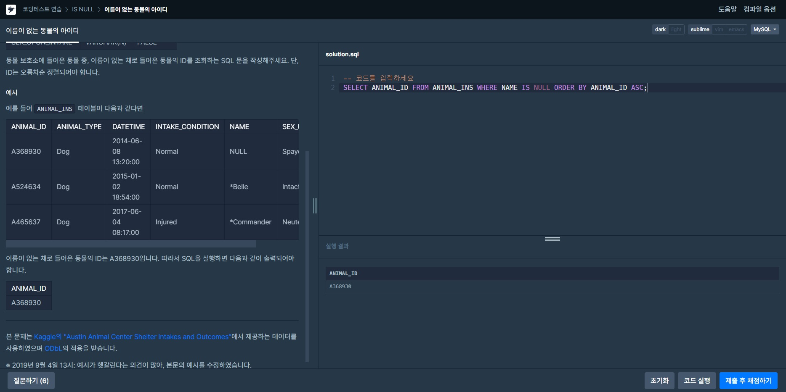
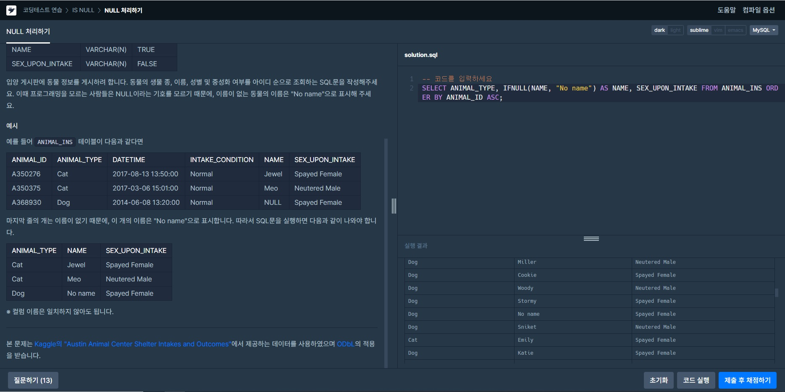

# IS NULL
 

## 이름이 없는 동물의 아이디 
>문제: 동물 보호소에 들어온 동물 중, 이름이 없는 채로 들어온 동물의 ID를 조회하는 SQL 문을 작성해주세요. 단, ID는 오름차순 정렬되어야 합니다.  
>  
>**SELECT** ANIMAL_ID **FROM** ANIMAL_INS **WHERE** NAME **IS NULL ORDER BY** ANIMAL_ID **ASC**;  
>고유값인 ID로 조회하고 WHERE절을 이용하여 NAME의 값이 없는(NULL값인) 동물의 ID를 검색하도록 하고 결과는 ORDER BY로 오름차순 정렬을 했다.  

  

## 이름이 있는 동물의 아이디  
>문제: 동물 보호소에 들어온 동물 중, 이름이 있는 동물의 ID를 조회하는 SQL 문을 작성해주세요. 단, ID는 오름차순 정렬되어야 합니다.  
>  
>**SELECT** ANIMAL_ID **FROM** ANIMAL_INS **WHERE** NAME **IS NOT NULL ORDER BY** ANIMAL_ID **ASC**;  
>위 문제와 같은 방식이지만 "이름이 있는" 조건 이기에 NAMD이 NULL이 아닌 조건으로 조회했고 ID를 기준으로 오름차순 정렬을 했다.

 

## NULL 처리하기  
>문제: 입양 게시판에 동물 정보를 게시하려 합니다. 동물의 생물 종, 이름, 성별 및 중성화 여부를 아이디 순으로 조회하는 SQL문을 작성해주세요. 이때 프로그래밍을 모르는 사람들은 NULL이라는 기호를 모르기 때문에, 이름이 없는 동물의 이름은 "No name"으로 표시해 주세요.  
>  
>**SELECT** ANIMAL_TYPE, **IFNULL**(NAME, "No name") **AS** NAME, SEX_UPON_INTAKE **FROM** ANIMAL_INS **ORDER BY** ANIMAL_ID **ASC**;  
>MySql의 함수인 IFNULL이다 IFNULL(a, b) -> a의 값이 null이라면 b를 출력하는 함수이다.  
>
>Oracle에서는 NVl, NVL2, NULLIF가 있고  
>MySql에서는 IFNULL이 있다.  
>모든 DBMS에서 사용 가능한 COALESCE 함수를 이용하는 방법도 있다.  
