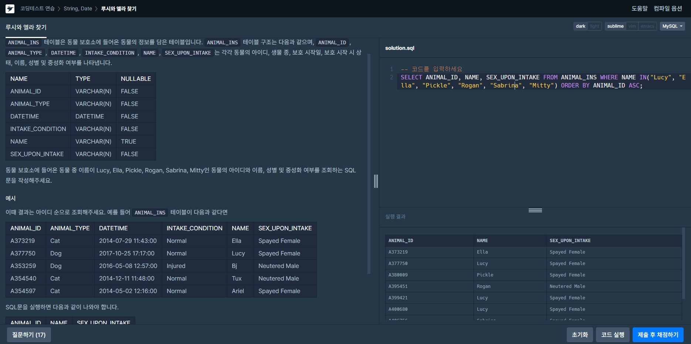
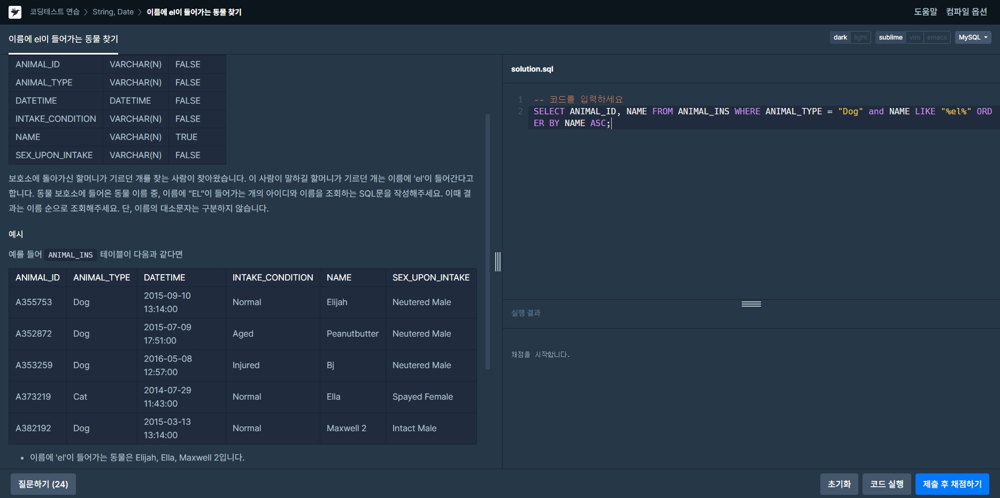

# String, Date
 

## 루시와 엘라 찾기
>문제: 동물 보호소에 들어온 동물 중 이름이 Lucy, Ella, Pickle, Rogan, Sabrina, Mitty인 동물의 아이디와 이름, 성별 및 중성화 여부를 조회하는 SQL 문을 작성해주세요.   
>  
>**SELECT** ANIMAL_ID, NAME, SEX_UPON_INTAKE **FROM** ANIMAL_INS **WHERE** NAME **IN**("Lucy", "Ella", "Pickle", "Rogan", "Sabrina", "Mitty") **ORDER BY** ANIMAL_ID **ASC**;  
>WHERE절을 이용하여 NAME이 IN(값)안에 포함되는 값을 찾도록 했다.  

  

## 이름에 el이 들어가는 동물 찾기
>문제: 보호소에 돌아가신 할머니가 기르던 개를 찾는 사람이 찾아왔습니다. 이 사람이 말하길 할머니가 기르던 개는 이름에 'el'이 들어간다고 합니다. 동물 보호소에 들어온 동물 이름 중, 이름에 "EL"이 들어가는 개의 아이디와 이름을 조회하는 SQL문을 작성해주세요. 이때 결과는 이름 순으로 조회해주세요. 단, 이름의 대소문자는 구분하지 않습니다.  
>  
>**SELECT** ANIMAL_ID, NAME **FROM** ANIMAL_INS **WHERE** ANIMAL_TYPE = "Dog" **and** NAME **LIKE** "%el%" **ORDER BY** NAME **ASC**;  
>WHERE절에 ANIMAL_TYPE이 Dog이고 이름에 el이 포함되기에 LIKE를 이용하였고 el이 어디에 포함될지 모르기에 %el% 이렇게 조회했다.  
>
>처음에 아래와 같은 코드를 작성한 후 오답처리를 받았다.  
>**SELECT** ANIMAL_ID, NAME **FROM** ANIMAL_INS **WHERE** NAME **LIKE** "%el%" **ORDER BY** NAME **ASC**;  
>정답이 아닌 이유는 문제에 "할머니가 기르던 개" 이기에 ANIMAL_TYPE에서 "Dog"를 조건으로 거는 것이 아니라 다른 동물들도 조회했기에 나온 오답이었다.  
