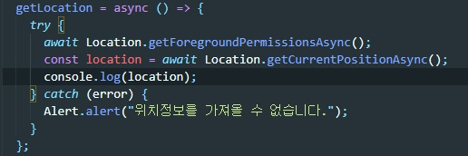
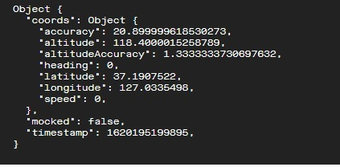
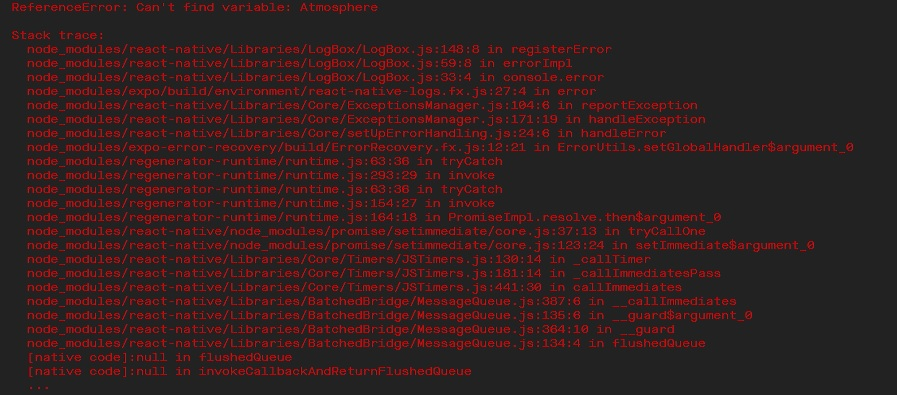

# my-weather

> React Native를 이용해 날씨앱 만들기

## 구동 화면

  

<br>

## 1.0 사용기술

> node version 12.20.1  
> expo  
> axios  
> expo 내장 Icon  
> expo-liner-gradient(css 그라데이션)  
> Open Weather API[링크](https://openweathermap.org/api)

### Expo [링크](https://docs.expo.io/)

> expo를 사용한 이유는 React Native를 위한 설정 파일 같은 것들이 없는 방식으로 모든것이 셋업 되어있다.  
> window환경에서 ios를 테스트 할 수 있다.

### expo-location

> navite에서 제공하는 api가 있지만 expo에서 제공하는 위치 api의 신뢰성이 높아서 사용
> npm install expo-location 으로 설치

<br>

## 2.0 설명

> 아래의 방식을 통해 위치 정보를 추출한다.
>   
> 

<br>

## 3.0 에러

>   
> npm start 명령어로 expo 실행 후 Tunnel로 바꾸자 만난 에러  
> **해결방법**  
> npm install @expo/ngrok@2.4.3 명령어 입력 후 설치

>   
> ReferenceError: Can't find variable: Atmosphere에러
> Weather.js에서 weatherBackground 객체를 만들고나서 발생
> **해결방법**  
``` Thunderstorm: {
    iconName: "weather-lightning",
    gradient: ["#373B44", "#4286f4"],
},  
 Drizzle: {  
 iconName: "weather-rainy",  
 gradient: ["#74ebd5", "#ACB6E5"],  
 } ```

> 이런식으로 하나씩 해야 하는데  
```Thunderstorm, Drizzle: {
    iconName: "weather-lightning",
    gradient: ["#373B44", "#4286f4"],
}```

> 이렇게 한번에 하려고 해서 에러가 발생했다.
